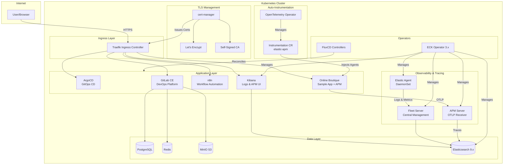
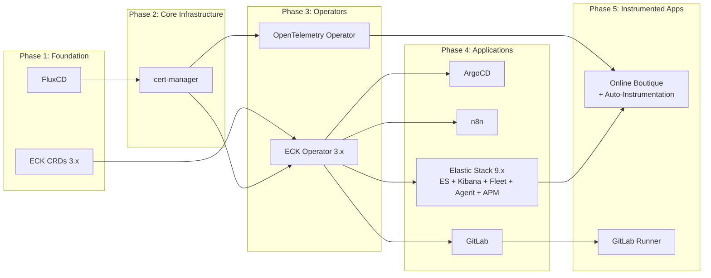
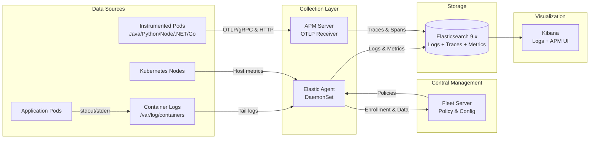
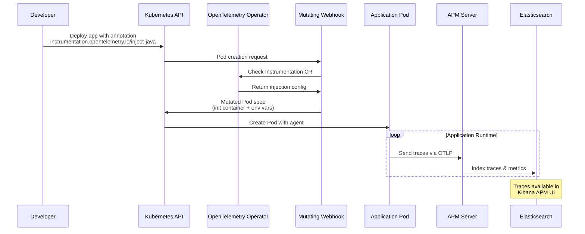

# Dorkomen Chart - Quickstart Guide

A curated Kubernetes platform deployment using GitOps (FluxCD) that includes:
- **Cert-Manager** - TLS certificate management
- **ECK Operator 3.x** - Elastic Cloud on Kubernetes (supports Elastic 9.x)
- **Elastic Stack 9.x** - Elasticsearch, Kibana, Fleet Server, Elastic Agent, APM Server
- **OpenTelemetry Operator** - Auto-instrumentation for distributed tracing
- **GitLab** - DevOps platform (CE edition)
- **GitLab Runner** - CI/CD runner
- **ArgoCD** - GitOps continuous delivery
- **n8n** - Workflow automation
- **Microservices Demo** - Google Cloud's Online Boutique sample application (11 microservices with APM)

## Prerequisites

Before deploying, ensure you have:

1. **Kubernetes Cluster** (v1.28+)
   - Rancher Desktop, k3s, or any compatible cluster
   - Traefik ingress controller (included with k3s/Rancher Desktop)

2. **Helm** (v3.x)
   ```bash
   # Verify installation
   helm version
   ```

3. **kubectl** configured to access your cluster
   ```bash
   kubectl cluster-info
   ```

4. **Domain Name** (for Let's Encrypt certificates)
   - A domain you own (e.g., `yourdomain.com`)
   - DNS managed by a supported provider (Cloudflare, Route53, etc.)

5. **DNS Provider API Token** (for DNS-01 challenge)
   - Required for automatic TLS certificate issuance

---

## Step 1: Install FluxCD

The dorkomen chart uses FluxCD for GitOps-based deployments. Install FluxCD first:

```bash
kubectl apply -f https://github.com/fluxcd/flux2/releases/latest/download/install.yaml

# Wait for Flux controllers to be ready
kubectl -n flux-system rollout status deployment/helm-controller
kubectl -n flux-system rollout status deployment/source-controller
```

## Step 2: Install ECK CRDs

The Elastic Stack requires ECK Operator CRDs (version 3.x for Elastic 9.x support):

```bash
kubectl create -f https://download.elastic.co/downloads/eck/3.2.0/crds.yaml
```

## Step 3: Configure Your Domain

Edit `chart/values.yaml` and update the domain:

```yaml
# Domain for ingress/services
domain: yourdomain.com

# ClusterIssuer to use for certificates
# Options: "dorkomen-ca" (self-signed), "letsencrypt-staging" (testing), "letsencrypt-prod" (production)
clusterIssuer: letsencrypt-prod
```

## Step 4: Configure Let's Encrypt with DNS Provider

### Option A: Cloudflare

1. **Create Cloudflare API Token**
   - Go to [Cloudflare Dashboard](https://dash.cloudflare.com) → My Profile → API Tokens
   - Create token with permissions:
     - `Zone - Zone - Read`
     - `Zone - DNS - Edit`
   - Zone Resources: Include → Specific zone → `yourdomain.com`

2. **Create Kubernetes Secret**
   ```bash
   kubectl create namespace cert-manager

   kubectl create secret generic cloudflare-api-token \
     --namespace cert-manager \
     --from-literal=api-token=YOUR_CLOUDFLARE_TOKEN
   ```

3. **Update values.yaml**
   ```yaml
   certManager:
     enabled: true
     clusterIssuers:
       letsencrypt:
         enabled: true
         name: letsencrypt-prod
         email: "your-email@example.com"
         solver:
           type: dns01
           dns01:
             provider: "cloudflare"
             cloudflare:
               email: "your-email@example.com"
               apiTokenSecretRef:
                 name: cloudflare-api-token
                 key: api-token
   ```

### Option B: AWS Route53

1. **Create IAM credentials** with Route53 permissions

2. **Create Kubernetes Secret**
   ```bash
   kubectl create namespace cert-manager

   kubectl create secret generic route53-credentials \
     --namespace cert-manager \
     --from-literal=access-key-id=YOUR_ACCESS_KEY \
     --from-literal=secret-access-key=YOUR_SECRET_KEY
   ```

3. **Update values.yaml**
   ```yaml
   certManager:
     clusterIssuers:
       letsencrypt:
         enabled: true
         email: "your-email@example.com"
         solver:
           type: dns01
           dns01:
             provider: "route53"
             route53:
               region: us-east-1
   ```

### Option C: Self-Signed Certificates (Development Only)

For local development without a real domain:

```yaml
clusterIssuer: dorkomen-ca

certManager:
  clusterIssuers:
    selfSignedCA:
      enabled: true
```

You'll need to trust the CA certificate in your browser.

## Step 5: Enable/Disable Components

Toggle components in `values.yaml`:

```yaml
certManager:
  enabled: true

eckOperator:
  enabled: true

elasticStack:
  enabled: true
  version: "9.2.3"           # Elastic Stack version
  apmServer:
    enabled: true            # Standalone APM Server for traces

opentelemetryOperator:
  enabled: true              # Auto-instrumentation for tracing
  instrumentation:
    enabled: true            # Deploy Instrumentation CR

gitlab:
  enabled: true

gitlabRunner:
  enabled: true

argocd:
  enabled: true

n8n:
  enabled: true

microservicesDemo:
  enabled: true              # Online Boutique sample app
  apm:
    enabled: true            # Enable APM auto-instrumentation
```

## Step 6: Deploy the Chart

```bash
helm upgrade --install dorkomen ./chart \
  --namespace flux-system \
  --create-namespace \
  --wait \
  --timeout 10m
```

## Step 7: Monitor Deployment Progress

Watch HelmReleases reconcile:

```bash
# Check HelmRelease status
kubectl get helmreleases -A -w

# Check all pods
kubectl get pods -A

# Check certificates
kubectl get certificates -A
```

Expected progression:
1. cert-manager → Ready
2. eck-operator → Ready
3. elastic-stack, opentelemetry-operator, argocd, n8n → Ready (parallel)
4. gitlab → Ready (takes 5-10 minutes)
5. gitlab-runner, microservices-demo → Ready (after dependencies)

## Step 8: Configure DNS / Hosts File

### For Production (Real Domain)
Add DNS A records pointing to your cluster's ingress IP:
- `argocd.yourdomain.com` → `<cluster-ip>`
- `gitlab.yourdomain.com` → `<cluster-ip>`
- `registry.yourdomain.com` → `<cluster-ip>`
- `n8n.yourdomain.com` → `<cluster-ip>`
- `kibana.yourdomain.com` → `<cluster-ip>`

### For Local Development
Add entries to your hosts file:

**Windows:** `C:\Windows\System32\drivers\etc\hosts`
**Linux/Mac:** `/etc/hosts`

```
192.168.127.2 argocd.yourdomain.com
192.168.127.2 gitlab.yourdomain.com
192.168.127.2 registry.yourdomain.com
192.168.127.2 n8n.yourdomain.com
192.168.127.2 kibana.yourdomain.com
```

Replace `192.168.127.2` with your cluster's ingress IP.

## Step 9: Access Services

| Service | URL | Default Credentials |
|---------|-----|---------------------|
| ArgoCD | https://argocd.yourdomain.com | Username: `admin`, Password: see below |
| GitLab | https://gitlab.yourdomain.com | Username: `root`, Password: see below |
| n8n | https://n8n.yourdomain.com | Create on first login |
| Kibana | https://kibana.yourdomain.com | Username: `elastic`, Password: see below |
| Online Boutique | https://boutique.yourdomain.com | No authentication required |

### Get ArgoCD Admin Password
```bash
kubectl -n argocd get secret argocd-argocd-initial-admin-secret \
  -o jsonpath="{.data.password}" | base64 -d
```

### Get GitLab Root Password
```bash
kubectl -n gitlab get secret gitlab-gitlab-initial-root-password \
  -o jsonpath="{.data.password}" | base64 -d
```

### Get Elasticsearch Password
```bash
kubectl -n elastic-stack get secret elasticsearch-es-elastic-user \
  -o jsonpath="{.data.elastic}" | base64 -d
```

---

## Configuration Reference

### Global Settings

| Setting | Description | Default |
|---------|-------------|---------|
| `domain` | Base domain for all services | `dorkomen.local` |
| `clusterIssuer` | Certificate issuer to use | `dorkomen-ca` |
| `httpsRedirect` | Redirect HTTP to HTTPS | `true` |
| `imagePullPolicy` | Image pull policy | `IfNotPresent` |

### Resource Requirements

Minimum recommended resources for all components:

| Component | CPU Request | Memory Request |
|-----------|-------------|----------------|
| cert-manager | 50m | 64Mi |
| eck-operator | 100m | 150Mi |
| elasticsearch | 500m | 1Gi |
| kibana | 250m | 512Mi |
| apm-server | 100m | 256Mi |
| fleet-server | 100m | 256Mi |
| elastic-agent | 200m | 1Gi |
| opentelemetry-operator | 100m | 128Mi |
| gitlab | 1000m | 4Gi |
| argocd | 250m | 256Mi |
| n8n | 100m | 256Mi |
| microservices-demo | 1200m | 1.5Gi |

**Total:** ~4 CPU cores, ~10GB RAM minimum (with all components enabled)

---

## Troubleshooting

### Certificates Not Issuing

1. Check ClusterIssuer status:
   ```bash
   kubectl get clusterissuers
   kubectl describe clusterissuer letsencrypt-prod
   ```

2. Check Certificate status:
   ```bash
   kubectl get certificates -A
   kubectl describe certificate <name> -n <namespace>
   ```

3. Check Challenges:
   ```bash
   kubectl get challenges -A
   kubectl describe challenge <name> -n <namespace>
   ```

4. Check cert-manager logs:
   ```bash
   kubectl logs -n cert-manager deployment/cert-manager-cert-manager
   ```

### HelmRelease Stuck

1. Check HelmRelease status:
   ```bash
   kubectl describe helmrelease <name> -n flux-system
   ```

2. Check Helm controller logs:
   ```bash
   kubectl logs -n flux-system deployment/helm-controller
   ```

### DNS-01 Challenge Failing

Common issues:
- **"Authentication error"**: Check API token permissions
- **"Zone not found"**: Ensure token has Zone Read permission
- **"Propagation timeout"**: DNS propagation may take time, wait and retry

### Pods Not Starting

1. Check pod events:
   ```bash
   kubectl describe pod <pod-name> -n <namespace>
   ```

2. Check for resource constraints:
   ```bash
   kubectl top nodes
   kubectl describe node <node-name>
   ```

### APM / OpenTelemetry Troubleshooting

#### Verify OpenTelemetry Operator is Running

```bash
# Check operator deployment
kubectl get deployment -n opentelemetry-operator-system

# Check operator logs
kubectl logs -n opentelemetry-operator-system deployment/opentelemetry-operator-controller-manager -f

# Check Instrumentation CR status
kubectl get instrumentation -A
kubectl describe instrumentation elastic-apm -n opentelemetry-operator-system
```

#### Verify APM Server is Running

```bash
# Check APM Server status
kubectl get apmserver -n elastic-stack

# Check APM Server pods
kubectl get pods -n elastic-stack -l apm.k8s.elastic.co/name=apm-server

# Check APM Server logs
kubectl logs -n elastic-stack -l apm.k8s.elastic.co/name=apm-server -f

# Test APM Server endpoint
kubectl exec -n elastic-stack deployment/apm-server-apm-server -- curl -s http://localhost:8200/
```

#### Verify Auto-Instrumentation is Injected

```bash
# Check if pods have instrumentation annotations
kubectl get pods -n microservices-demo -o jsonpath='{range .items[*]}{.metadata.name}{"\t"}{.metadata.annotations}{"\n"}{end}' | grep instrumentation

# Check for init containers (indicates agent injection)
kubectl get pods -n microservices-demo -o jsonpath='{range .items[*]}{.metadata.name}: {range .spec.initContainers[*]}{.name} {end}{"\n"}{end}'

# Describe a pod to see injected environment variables
kubectl describe pod -n microservices-demo -l app=adservice | grep -A 20 "Environment:"
```

#### Verify Traces in Elasticsearch

```bash
# Get Elasticsearch password
ES_PASSWORD=$(kubectl -n elastic-stack get secret elasticsearch-es-elastic-user -o jsonpath="{.data.elastic}" | base64 -d)

# Port-forward to Elasticsearch
kubectl port-forward -n elastic-stack svc/elasticsearch-es-http 9200:9200 &

# Query trace indices
curl -sk -u "elastic:$ES_PASSWORD" "https://localhost:9200/_cat/indices?v" | grep -E "(traces|apm)"

# Count traces
curl -sk -u "elastic:$ES_PASSWORD" "https://localhost:9200/traces-apm*/_count" | jq .

# Search for recent traces
curl -sk -u "elastic:$ES_PASSWORD" "https://localhost:9200/traces-apm*/_search?size=5" | jq '.hits.hits[]._source.service.name'
```

#### View Traces in Kibana APM UI

1. Navigate to `https://kibana.yourdomain.com`
2. Login with `elastic` user (password from `elasticsearch-es-elastic-user` secret)
3. Go to **Observability** → **APM** → **Services**
4. You should see services like: adservice, cartservice, checkoutservice, currencyservice, emailservice, frontend, paymentservice, productcatalogservice, recommendationservice, shippingservice

#### Common Issues

**No traces appearing:**
1. Check APM Server is receiving data:
   ```bash
   kubectl logs -n elastic-stack -l apm.k8s.elastic.co/name=apm-server | grep -i "request"
   ```

2. Check pods were restarted after instrumentation was enabled:
   ```bash
   # Restart deployments to pick up instrumentation
   kubectl rollout restart deployment -n microservices-demo
   ```

3. Verify mutating webhook is working:
   ```bash
   kubectl get mutatingwebhookconfiguration | grep opentelemetry
   ```

**Instrumentation not being injected:**
1. Verify the Instrumentation CR exists and has correct namespace:
   ```bash
   kubectl get instrumentation -A
   ```

2. Check pod annotations match the instrumentation namespace/name:
   ```bash
   # Expected annotation format: instrumentation.opentelemetry.io/inject-<language>: "<namespace>/<name>"
   kubectl get deployment adservice -n microservices-demo -o yaml | grep -A 5 annotations
   ```

3. Check OpenTelemetry Operator logs for injection errors:
   ```bash
   kubectl logs -n opentelemetry-operator-system deployment/opentelemetry-operator-controller-manager | grep -i error
   ```

**Go services not showing traces:**
Go auto-instrumentation uses eBPF and requires privileged containers. Ensure:
1. Go instrumentation is enabled: `extraArgs: ["--enable-go-instrumentation=true"]`
2. Operator has necessary permissions

---

## Uninstalling

To remove the deployment:

```bash
# Remove the Helm release
helm uninstall dorkomen -n flux-system

# Remove FluxCD (optional)
kubectl delete -f https://github.com/fluxcd/flux2/releases/latest/download/install.yaml

# Remove ECK CRDs (optional)
kubectl delete -f https://download.elastic.co/downloads/eck/3.2.0/crds.yaml

# Clean up namespaces
kubectl delete namespace cert-manager eck-operator gitlab gitlab-runner argocd n8n elastic-stack opentelemetry-operator-system microservices-demo
```

---

## Architecture

### High-Level Overview

The Dorkomen chart deploys a complete platform stack using GitOps principles. The Helm chart creates FluxCD HelmReleases that manage individual component deployments.

#### ASCII Architecture Diagram

```
┌─────────────────────────────────────────────────────────────────────────────────┐
│                              KUBERNETES CLUSTER                                 │
├─────────────────────────────────────────────────────────────────────────────────┤
│                                                                                 │
│  ┌─────────────────────────────────────────────────────────────────────────┐    │
│  │                         INGRESS LAYER (Traefik)                         │    │
│  │  ┌────────┐ ┌────────┐ ┌────────┐ ┌────────┐ ┌────────┐ ┌────────────┐  │    │
│  │  │ArgoCD  │ │ GitLab │ │  n8n   │ │ Kibana │ │Registry│ │  Boutique  │  │    │
│  │  │:443    │ │ :443   │ │ :443   │ │ :443   │ │ :443   │ │   :443     │  │    │
│  │  └───┬────┘ └───┬────┘ └───┬────┘ └───┬────┘ └───┬────┘ └─────┬──────┘  │    │
│  └──────┼──────────┼──────────┼──────────┼──────────┼────────────┼─────────┘    │
│         │          │          │          │          │            │              │
│  ┌──────┴──────────┴──────────┴──────────┴──────────┴────────────┴─────────┐    │
│  │                         TLS CERTIFICATES (cert-manager)                 │    │
│  │                    ClusterIssuer: Let's Encrypt / Self-Signed           │    │
│  └─────────────────────────────────────────────────────────────────────────┘    │
│                                                                                 │
│  ┌────────────────────────────────────────────────────────────────────────┐     │
│  │                           APPLICATION LAYER                            │     │
│  │                                                                        │     │
│  │  ┌─────────────┐  ┌─────────────┐  ┌─────────────┐  ┌─────────────┐    │     │
│  │  │   ArgoCD    │  │   GitLab    │  │     n8n     │  │   Kibana    │    │     │
│  │  │  (GitOps)   │  │  (DevOps)   │  │ (Workflow)  │  │(Logs & APM) │    │     │
│  │  │             │  │             │  │             │  │             │    │     │
│  │  │ - Server    │  │ - Webservice│  │ - Worker    │  │ - Dashboard │    │     │
│  │  │ - Repo Srv  │  │ - Sidekiq   │  │ - Webhook   │  │ - APM UI    │    │     │
│  │  │ - AppSet    │  │ - Registry  │  │             │  │ - Alerts    │    │     │
│  │  │ - Redis     │  │ - Shell     │  │             │  │             │    │     │
│  │  └─────────────┘  │ - Gitaly    │  └─────────────┘  └──────┬──────┘    │     │
│  │                   │ - KAS       │                          │           │     │
│  │                   └──────┬──────┘                          │           │     │
│  │                          │                                 │           │     │
│  │  ┌─────────────────────────────────────────────────────────────────┐   │     │
│  │  │        MICROSERVICES DEMO (Online Boutique) - APM Testbed       │   │     │
│  │  │                                                                 │   │     │
│  │  │  ┌─────────┐ ┌─────────┐ ┌─────────┐ ┌─────────┐ ┌─────────┐    │   │     │
│  │  │  │Frontend │ │  Cart   │ │Checkout │ │ Product │ │Currency │    │   │     │
│  │  │  │  (Go)   │ │ (.NET)  │ │  (Go)   │ │  (Go)   │ │(Node.js)│    │   │     │
│  │  │  └────┬────┘ └────┬────┘ └────┬────┘ └────┬────┘ └────┬────┘    │   │     │
│  │  │       │           │           │           │           │         │   │     │
│  │  │  ┌─────────┐ ┌─────────┐ ┌─────────┐ ┌─────────┐ ┌─────────┐    │   │     │
│  │  │  │Payment  │ │Shipping │ │  Email  │ │Recommend│ │   Ad    │    │   │     │
│  │  │  │(Node.js)│ │  (Go)   │ │(Python) │ │(Python) │ │ (Java)  │    │   │     │
│  │  │  └────┬────┘ └────┬────┘ └────┬────┘ └────┬────┘ └────┬────┘    │   │     │
│  │  │       │           │           │           │           │         │   │     │
│  │  │       └───────────┴───────────┴─────┬─────┴───────────┘         │   │     │
│  │  │                    All services auto-instrumented               │   │     │
│  │  │                    via OpenTelemetry Operator                   │   │     │
│  │  └──────────────────────────────┬──────────────────────────────────┘   │     │
│  │                                 │ OTLP traces                          │     │
│  └─────────────────────────────────┼──────────────────────────────────────┘     │
│                                    │                                            │
│  ┌─────────────────────────────────────────────────────────────────────────┐    │
│  │                    OBSERVABILITY & TRACING LAYER                        │    │
│  │                                                                         │    │
│  │  ┌───────────────────────┐  ┌───────────────────┐  ┌─────────────────┐  │    │
│  │  │     Fleet Server      │  │   Elastic Agent   │  │   APM Server    │  │    │
│  │  │      (Central)        │  │    (DaemonSet)    │  │   (Traces)      │  │    │
│  │  │                       │  │                   │  │                 │  │    │
│  │  │ - Agent policies      │  │ - Container logs  │  │ - OTLP/gRPC     │  │    │
│  │  │ - Centralized config  │  │ - Node metrics    │  │ - OTLP/HTTP     │  │    │
│  │  │ - Agent enrollment    │  │ - K8s metadata    │  │ - RUM support   │  │    │
│  │  └───────────┬───────────┘  └─────────┬─────────┘  └────────┬────────┘  │    │
│  │              │                        │                     │           │    │
│  │              └────────────────────────┴─────────────────────┘           │    │
│  │                                       │                                 │    │
│  │                                       ▼                                 │    │
│  │                              Elasticsearch                              │    │
│  └─────────────────────────────────────────────────────────────────────────┘    │
│                                                                                 │
│  ┌─────────────────────────────────────────────────────────────────────────┐    │
│  │                            DATA LAYER                                   │    │
│  │                                                                         │    │
│  │  ┌─────────────┐  ┌─────────────┐  ┌─────────────┐  ┌─────────────┐     │    │
│  │  │ PostgreSQL  │  │    Redis    │  │    MinIO    │  │Elasticsearch│     │    │
│  │  │  (GitLab)   │  │  (GitLab)   │  │  (GitLab)   │  │ (Logs/APM)  │     │    │
│  │  └─────────────┘  └─────────────┘  └─────────────┘  └─────────────┘     │    │
│  └─────────────────────────────────────────────────────────────────────────┘    │
│                                                                                 │
│  ┌─────────────────────────────────────────────────────────────────────────┐    │
│  │                     AUTO-INSTRUMENTATION LAYER                          │    │
│  │                                                                         │    │
│  │  ┌───────────────────────────────────────────────────────────────────┐  │    │
│  │  │              OpenTelemetry Operator                               │  │    │
│  │  │                                                                   │  │    │
│  │  │  ┌──────────────────────────────────────────────────────────────┐ │  │    │
│  │  │  │                 Instrumentation CR (elastic-apm)             │ │  │    │
│  │  │  │                                                              │ │  │    │
│  │  │  │  Auto-injects agents via Mutating Webhook:                   │ │  │    │
│  │  │  │  • Java (EDOT Agent)  • Python  • Node.js  • .NET  • Go      │ │  │    │
│  │  │  └──────────────────────────────────────────────────────────────┘ │  │    │
│  │  │                                                                   │  │    │
│  │  │  Annotated pods get init containers with language agents          │  │    │
│  │  └───────────────────────────────────────────────────────────────────┘  │    │
│  └─────────────────────────────────────────────────────────────────────────┘    │
│                                                                                 │
│  ┌─────────────────────────────────────────────────────────────────────────┐    │
│  │                         OPERATORS & CONTROLLERS                         │    │
│  │                                                                         │    │
│  │  ┌─────────────┐  ┌─────────────┐  ┌─────────────┐  ┌───────────────┐   │    │
│  │  │cert-manager │  │ECK Operator │  │   FluxCD    │  │  OTel Operator│   │    │
│  │  │             │  │    3.x      │  │             │  │               │   │    │
│  │  │ - Controller│  │ - ES/Kibana │  │ - Helm Ctrl │  │ - Instr. CR   │   │    │
│  │  │ - Webhook   │  │ - Fleet/APM │  │ - Source    │  │ - Pod Mutator │   │    │
│  │  │ - CAInjector│  │ - Agent     │  │ - Kustomize │  │ - Webhook     │   │    │
│  │  └─────────────┘  └─────────────┘  └─────────────┘  └───────────────┘   │    │
│  └─────────────────────────────────────────────────────────────────────────┘    │
│                                                                                 │
└─────────────────────────────────────────────────────────────────────────────────┘
```

#### Mermaid Architecture Diagram



#### Component Dependency Diagram



#### Data Flow Diagram



### Microservices Demo (Online Boutique) - Observability Testbed

The **Online Boutique** (Google Cloud's microservices-demo) is deployed as an **observability testbed** to validate and demonstrate the APM auto-instrumentation capabilities of this platform. It serves as a real-world example of distributed tracing across polyglot microservices.

**Why Online Boutique?**
- **Multi-language coverage**: Services written in Go, Java, Python, Node.js, and C#/.NET - covering all major OpenTelemetry auto-instrumentation agents
- **Realistic traffic patterns**: Built-in LoadGenerator creates continuous synthetic traffic for trace generation
- **Complex service mesh**: 11 interconnected services with gRPC communication, demonstrating distributed tracing across service boundaries
- **Production-like architecture**: Frontend → Backend services → Database pattern with realistic checkout/payment flows

**Observability Features Demonstrated:**
- Automatic trace injection via OpenTelemetry Operator mutating webhooks
- End-to-end distributed traces from frontend to backend services
- Service dependency maps in Kibana APM UI
- Transaction timing and error rate monitoring
- Cross-service correlation using trace context propagation

```mermaid
flowchart TB
    subgraph Internet
        User[User Browser]
    end

    subgraph Cluster["microservices-demo namespace"]
        subgraph Frontend["Frontend Layer"]
            FE[Frontend<br/>Go :80<br/>🔍 Go Agent]
        end

        subgraph Services["Business Services"]
            Cart[CartService<br/>C# :7070<br/>🔍 .NET Agent]
            Checkout[CheckoutService<br/>Go :5050<br/>🔍 Go Agent]
            Product[ProductCatalogService<br/>Go :3550<br/>🔍 Go Agent]
            Currency[CurrencyService<br/>Node.js :7000<br/>🔍 Node Agent]
            Payment[PaymentService<br/>Node.js :50051<br/>🔍 Node Agent]
            Shipping[ShippingService<br/>Go :50051<br/>🔍 Go Agent]
            Email[EmailService<br/>Python :5000<br/>🔍 Python Agent]
            Recommend[RecommendationService<br/>Python :8080<br/>🔍 Python Agent]
            Ad[AdService<br/>Java :9555<br/>🔍 Java EDOT Agent]
        end

        subgraph Data["Data Layer"]
            Redis[(Redis Cart<br/>:6379)]
        end

        subgraph Load["Load Generation"]
            LoadGen[LoadGenerator<br/>Python<br/>🔍 Python Agent]
        end
    end

    subgraph Tracing["APM & Tracing"]
        APM[APM Server<br/>:8200]
        ES[(Elasticsearch)]
    end

    User -->|HTTPS via Ingress| FE
    FE --> Cart
    FE --> Product
    FE --> Currency
    FE --> Checkout
    FE --> Recommend
    FE --> Ad

    Checkout --> Cart
    Checkout --> Product
    Checkout --> Currency
    Checkout --> Payment
    Checkout --> Shipping
    Checkout --> Email

    Recommend --> Product
    Cart --> Redis

    LoadGen -->|Synthetic Traffic| FE

    FE -.->|OTLP| APM
    Cart -.->|OTLP| APM
    Checkout -.->|OTLP| APM
    Currency -.->|OTLP| APM
    Payment -.->|OTLP| APM
    Email -.->|OTLP| APM
    Recommend -.->|OTLP| APM
    Ad -.->|OTLP| APM
    LoadGen -.->|OTLP| APM
    APM --> ES
```



#### Online Boutique Service Details

| Service | Language | Description | Port | OTel Agent |
|---------|----------|-------------|------|------------|
| frontend | Go | Web UI, serves HTTP requests | 80 | Go (eBPF)* |
| cartservice | C# | Manages user shopping carts | 7070 | .NET |
| productcatalogservice | Go | Provides product catalog data | 3550 | Go (eBPF)* |
| currencyservice | Node.js | Converts currencies | 7000 | Node.js |
| paymentservice | Node.js | Mock payment processing | 50051 | Node.js |
| shippingservice | Go | Calculates shipping costs | 50051 | Go (eBPF)* |
| emailservice | Python | Sends order confirmation emails | 5000 | Python |
| checkoutservice | Go | Orchestrates the checkout process | 5050 | Go (eBPF)* |
| recommendationservice | Python | Product recommendations | 8080 | Python |
| adservice | Java | Serves contextual advertisements | 9555 | Java (EDOT) |
| redis-cart | Redis | Cart data storage | 6379 | - |
| loadgenerator | Python | Generates synthetic user traffic | - | Python |

*Go auto-instrumentation requires `OTEL_GO_AUTO_TARGET_EXE` to be set for full tracing support.

#### APM Auto-Instrumentation Flow



### Namespace Layout

```
┌─────────────────────────────────────────────────────────────────────────────┐
│                              NAMESPACES                                       │
├─────────────────────────────────────────────────────────────────────────────┤
│                                                                               │
│  flux-system                    ← FluxCD controllers + HelmReleases           │
│  cert-manager                   ← Certificate management                      │
│  eck-operator                   ← ECK Operator 3.x                            │
│  elastic-stack                  ← Elasticsearch 9.x, Kibana, Fleet,           │
│                                   Agent, APM Server                           │
│  opentelemetry-operator-system  ← OpenTelemetry Operator + Instrumentation CR │
│  gitlab                         ← GitLab CE + PostgreSQL + Redis + MinIO      │
│  gitlab-runner                  ← GitLab Runner                               │
│  argocd                         ← ArgoCD                                      │
│  n8n                            ← n8n workflow automation                     │
│  microservices-demo             ← Online Boutique (11 microservices + APM)    │
│                                                                               │
└─────────────────────────────────────────────────────────────────────────────┘
```

---

## Advanced Configuration

### Custom Resource Limits

Override default resource allocations for any component:

```yaml
# values.yaml
elasticsearch:
  resources:
    limits:
      memory: 4Gi
      cpu: 2000m
    requests:
      memory: 2Gi
      cpu: 1000m

gitlab:
  values:
    gitlab:
      webservice:
        resources:
          limits:
            memory: 4Gi
          requests:
            cpu: 500m
            memory: 3Gi
```

### Multiple Elasticsearch Nodes

Scale Elasticsearch for production:

```yaml
elasticStack:
  elasticsearch:
    replicas: 3
    storage: 100Gi
    javaOpts: "-Xms2g -Xmx2g"
    resources:
      limits:
        memory: 4Gi
        cpu: 2000m
      requests:
        memory: 2Gi
        cpu: 1000m
```

### External Database for GitLab

Use an external PostgreSQL database:

```yaml
gitlab:
  values:
    postgresql:
      install: false
    global:
      psql:
        host: external-postgres.example.com
        port: 5432
        username: gitlab
        database: gitlabhq_production
        password:
          secret: gitlab-external-db-password
          key: password
```

### External Redis for GitLab

Use an external Redis instance:

```yaml
gitlab:
  values:
    redis:
      install: false
    global:
      redis:
        host: external-redis.example.com
        port: 6379
        password:
          enabled: true
          secret: gitlab-external-redis-password
          key: password
```

### S3-Compatible Object Storage for GitLab

Use external S3 storage instead of MinIO:

```yaml
gitlab:
  values:
    global:
      minio:
        enabled: false
      appConfig:
        lfs:
          bucket: gitlab-lfs
          connection:
            secret: gitlab-s3-credentials
            key: connection
        artifacts:
          bucket: gitlab-artifacts
          connection:
            secret: gitlab-s3-credentials
            key: connection
        uploads:
          bucket: gitlab-uploads
          connection:
            secret: gitlab-s3-credentials
            key: connection
```

### Custom Ingress Annotations

Add custom annotations to ingresses:

```yaml
argocd:
  values:
    server:
      ingress:
        annotations:
          nginx.ingress.kubernetes.io/proxy-body-size: "100m"
          nginx.ingress.kubernetes.io/proxy-read-timeout: "600"
```

### Pod Affinity and Anti-Affinity

Spread pods across nodes:

```yaml
elasticStack:
  elasticsearch:
    nodeSelector:
      node-type: elastic
    tolerations:
      - key: "dedicated"
        operator: "Equal"
        value: "elastic"
        effect: "NoSchedule"
```

### Network Policies

Enable network policies for enhanced security:

```yaml
networkPolicies:
  enabled: true
  controlPlaneCidr: 10.0.0.0/8
  nodeCidr: 192.168.0.0/16
  vpcCidr: 10.0.0.0/8
```

### Disable HTTPS Redirect

For environments behind a TLS-terminating load balancer:

```yaml
httpsRedirect: false
```

### Custom FluxCD Settings

Override Flux reconciliation settings:

```yaml
flux:
  interval: 5m
  install:
    remediation:
      retries: 5
  upgrade:
    remediation:
      retries: 10
      remediateLastFailure: true
    cleanupOnFail: true
```

---

## Backup and Restore Procedures

### Overview

Critical data to backup:
1. **GitLab** - Repositories, CI/CD data, user data
2. **Elasticsearch** - Logs and indices
3. **ArgoCD** - Application definitions (stored in Git)
4. **n8n** - Workflow definitions
5. **Certificates** - TLS secrets (optional, can be re-issued)

### GitLab Backup

#### Create Backup

```bash
# Get the toolbox pod name
TOOLBOX_POD=$(kubectl get pods -n gitlab -l app=toolbox -o jsonpath='{.items[0].metadata.name}')

# Create a full backup
kubectl exec -n gitlab $TOOLBOX_POD -- gitlab-backup create

# List backups
kubectl exec -n gitlab $TOOLBOX_POD -- ls -la /var/opt/gitlab/backups/
```

#### Export Backup to Local Machine

```bash
# Get the backup filename
BACKUP_FILE=$(kubectl exec -n gitlab $TOOLBOX_POD -- ls /var/opt/gitlab/backups/ | grep _gitlab_backup.tar | tail -1)

# Copy backup locally
kubectl cp gitlab/$TOOLBOX_POD:/var/opt/gitlab/backups/$BACKUP_FILE ./$BACKUP_FILE
```

#### Backup GitLab Secrets

```bash
# Backup secrets separately (required for restore)
kubectl get secret gitlab-rails-secret -n gitlab -o yaml > gitlab-rails-secret.yaml
kubectl get secret gitlab-gitlab-initial-root-password -n gitlab -o yaml > gitlab-root-password.yaml
```

#### Restore GitLab

```bash
# Copy backup to toolbox pod
kubectl cp ./$BACKUP_FILE gitlab/$TOOLBOX_POD:/var/opt/gitlab/backups/

# Stop services
kubectl exec -n gitlab $TOOLBOX_POD -- gitlab-ctl stop puma
kubectl exec -n gitlab $TOOLBOX_POD -- gitlab-ctl stop sidekiq

# Restore (replace TIMESTAMP with your backup timestamp)
kubectl exec -n gitlab $TOOLBOX_POD -- gitlab-backup restore BACKUP=TIMESTAMP

# Restart services
kubectl exec -n gitlab $TOOLBOX_POD -- gitlab-ctl start
```

### Elasticsearch Backup

#### Setup Snapshot Repository

First, create a snapshot repository (using MinIO/S3):

```bash
# Create snapshot repository secret
kubectl create secret generic es-s3-credentials -n elastic-stack \
  --from-literal=s3.client.default.access_key=YOUR_ACCESS_KEY \
  --from-literal=s3.client.default.secret_key=YOUR_SECRET_KEY

# Register repository via Kibana Dev Tools or API
curl -X PUT "https://kibana.yourdomain.com/api/console/proxy?path=_snapshot/my_backup&method=PUT" \
  -H "kbn-xsrf: true" \
  -H "Content-Type: application/json" \
  -d '{
    "type": "s3",
    "settings": {
      "bucket": "elasticsearch-backups",
      "region": "us-east-1"
    }
  }'
```

#### Create Snapshot

```bash
# Create snapshot
curl -X PUT "https://kibana.yourdomain.com/api/console/proxy?path=_snapshot/my_backup/snapshot_$(date +%Y%m%d)&method=PUT" \
  -H "kbn-xsrf: true" \
  -H "Content-Type: application/json" \
  -d '{
    "indices": "*",
    "ignore_unavailable": true,
    "include_global_state": true
  }'
```

#### Restore Snapshot

```bash
# Close indices first
curl -X POST "https://kibana.yourdomain.com/api/console/proxy?path=_all/_close&method=POST" \
  -H "kbn-xsrf: true"

# Restore snapshot
curl -X POST "https://kibana.yourdomain.com/api/console/proxy?path=_snapshot/my_backup/snapshot_20241230/_restore&method=POST" \
  -H "kbn-xsrf: true" \
  -H "Content-Type: application/json" \
  -d '{
    "indices": "*",
    "ignore_unavailable": true,
    "include_global_state": true
  }'
```

### n8n Backup

n8n stores workflows in SQLite by default:

```bash
# Get n8n pod
N8N_POD=$(kubectl get pods -n n8n -l app.kubernetes.io/name=n8n -o jsonpath='{.items[0].metadata.name}')

# Backup SQLite database
kubectl cp n8n/$N8N_POD:/home/node/.n8n/database.sqlite ./n8n-backup.sqlite

# Restore
kubectl cp ./n8n-backup.sqlite n8n/$N8N_POD:/home/node/.n8n/database.sqlite
kubectl rollout restart deployment/n8n -n n8n
```

### ArgoCD Backup

ArgoCD applications should be stored in Git (GitOps). To backup ArgoCD configuration:

```bash
# Export all ArgoCD applications
kubectl get applications -n argocd -o yaml > argocd-applications.yaml

# Export ArgoCD projects
kubectl get appprojects -n argocd -o yaml > argocd-projects.yaml

# Export repositories
kubectl get secrets -n argocd -l argocd.argoproj.io/secret-type=repository -o yaml > argocd-repos.yaml
```

### Certificate Backup (Optional)

```bash
# Backup all TLS secrets
kubectl get secrets -A -o yaml | grep -A 100 'type: kubernetes.io/tls' > tls-secrets-backup.yaml

# Or backup specific secrets
kubectl get secret argocd-server-tls -n argocd -o yaml > argocd-tls.yaml
kubectl get secret n8n-tls -n n8n -o yaml > n8n-tls.yaml
kubectl get secret kibana-tls -n elastic-stack -o yaml > kibana-tls.yaml
```

### Automated Backup Script

```bash
#!/bin/bash
# backup-dorkomen.sh

BACKUP_DIR="./backups/$(date +%Y%m%d-%H%M%S)"
mkdir -p $BACKUP_DIR

echo "Backing up GitLab..."
TOOLBOX_POD=$(kubectl get pods -n gitlab -l app=toolbox -o jsonpath='{.items[0].metadata.name}')
kubectl exec -n gitlab $TOOLBOX_POD -- gitlab-backup create
BACKUP_FILE=$(kubectl exec -n gitlab $TOOLBOX_POD -- ls /var/opt/gitlab/backups/ | grep _gitlab_backup.tar | tail -1)
kubectl cp gitlab/$TOOLBOX_POD:/var/opt/gitlab/backups/$BACKUP_FILE $BACKUP_DIR/$BACKUP_FILE

echo "Backing up GitLab secrets..."
kubectl get secret gitlab-rails-secret -n gitlab -o yaml > $BACKUP_DIR/gitlab-rails-secret.yaml

echo "Backing up n8n..."
N8N_POD=$(kubectl get pods -n n8n -l app.kubernetes.io/name=n8n -o jsonpath='{.items[0].metadata.name}')
kubectl cp n8n/$N8N_POD:/home/node/.n8n/database.sqlite $BACKUP_DIR/n8n-database.sqlite

echo "Backing up ArgoCD..."
kubectl get applications -n argocd -o yaml > $BACKUP_DIR/argocd-applications.yaml
kubectl get appprojects -n argocd -o yaml > $BACKUP_DIR/argocd-projects.yaml

echo "Backing up TLS certificates..."
kubectl get secret argocd-server-tls -n argocd -o yaml > $BACKUP_DIR/argocd-tls.yaml
kubectl get secret n8n-tls -n n8n -o yaml > $BACKUP_DIR/n8n-tls.yaml
kubectl get secret kibana-tls -n elastic-stack -o yaml > $BACKUP_DIR/kibana-tls.yaml

echo "Backup complete: $BACKUP_DIR"
```

---

## Upgrade Procedures

### Pre-Upgrade Checklist

1. **Create backups** of all critical data (see Backup section)
2. **Review release notes** for breaking changes
3. **Test in staging** environment first
4. **Schedule maintenance window** for production upgrades
5. **Notify users** of potential downtime

### Upgrading the Dorkomen Chart

#### Step 1: Pull Latest Chart Changes

```bash
cd dorkomen-chart/base
git pull origin main
```

#### Step 2: Review Changes

```bash
# Compare values.yaml changes
git diff HEAD~1 chart/values.yaml

# Review Chart.yaml for version changes
cat chart/Chart.yaml
```

#### Step 3: Upgrade with Helm

```bash
# Dry-run first to see what will change
helm upgrade dorkomen ./chart \
  --namespace flux-system \
  --dry-run \
  --debug

# Apply the upgrade
helm upgrade dorkomen ./chart \
  --namespace flux-system \
  --wait \
  --timeout 15m
```

#### Step 4: Monitor Reconciliation

```bash
# Watch HelmReleases
kubectl get helmreleases -A -w

# Check for any failed releases
kubectl get helmreleases -A | grep -v "True"
```

### Upgrading Individual Components

#### Upgrade cert-manager

```yaml
# Update in values.yaml
certManager:
  helmRepo:
    tag: "v1.17.0"  # New version
  values:
    image:
      tag: v1.17.0
```

```bash
helm upgrade dorkomen ./chart -n flux-system
kubectl annotate helmrelease cert-manager -n flux-system \
  reconcile.fluxcd.io/requestedAt="$(date +%s)" --overwrite
```

#### Upgrade Elasticsearch

```yaml
# Update in values.yaml
elasticStack:
  version: "8.16.0"  # New version

eckOperator:
  helmRepo:
    tag: "2.15.0"
```

**Note:** Elasticsearch upgrades should be done one minor version at a time.

#### Upgrade GitLab

```yaml
# Update in values.yaml
gitlab:
  helmRepo:
    tag: "8.7.0"  # New version
```

**Important:** Always check GitLab upgrade path requirements.

#### Upgrade ArgoCD

```yaml
# Update in values.yaml
argocd:
  helmRepo:
    tag: "7.8.0"  # New version
  values:
    global:
      image:
        tag: "v2.14.0"
```

### Rolling Back

#### Rollback Helm Release

```bash
# List release history
helm history dorkomen -n flux-system

# Rollback to previous revision
helm rollback dorkomen <REVISION> -n flux-system
```

#### Rollback Individual HelmRelease

```bash
# Suspend the HelmRelease
kubectl patch helmrelease gitlab -n flux-system -p '{"spec":{"suspend":true}}' --type=merge

# Rollback the underlying Helm release
helm rollback gitlab-gitlab -n gitlab <REVISION>

# Resume HelmRelease (or keep suspended to prevent Flux from reverting)
kubectl patch helmrelease gitlab -n flux-system -p '{"spec":{"suspend":false}}' --type=merge
```

### Zero-Downtime Upgrade Strategy

For production environments requiring minimal downtime:

1. **Scale up replicas** before upgrade (if supported by component)
2. **Use PodDisruptionBudgets** to ensure availability
3. **Upgrade in stages:**
   - Infrastructure (cert-manager, ECK)
   - Supporting services (Elasticsearch, Redis)
   - Applications (GitLab, ArgoCD, n8n)

```yaml
# Example PDB for GitLab webservice
apiVersion: policy/v1
kind: PodDisruptionBudget
metadata:
  name: gitlab-webservice-pdb
  namespace: gitlab
spec:
  minAvailable: 1
  selector:
    matchLabels:
      app: webservice
```

### Post-Upgrade Verification

```bash
# Check all pods are running
kubectl get pods -A | grep -v Running | grep -v Completed

# Verify certificates
kubectl get certificates -A

# Check HelmRelease health
kubectl get helmreleases -A

# Test application endpoints
curl -I https://argocd.yourdomain.com
curl -I https://gitlab.yourdomain.com
curl -I https://n8n.yourdomain.com
curl -I https://kibana.yourdomain.com
```

---

## Next Steps

- [Configure GitLab Runner](https://docs.gitlab.com/runner/) for CI/CD pipelines
- [Set up ArgoCD Applications](https://argo-cd.readthedocs.io/) for GitOps deployments
- [Create n8n Workflows](https://docs.n8n.io/) for automation
- [Configure Kibana Dashboards](https://www.elastic.co/guide/en/kibana/current/index.html) for log visualization
- [Explore Kibana APM](https://www.elastic.co/guide/en/apm/guide/current/apm-ui.html) for distributed tracing and service maps
- [Configure OpenTelemetry](https://opentelemetry.io/docs/kubernetes/operator/) for custom instrumentation
